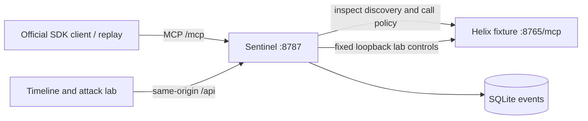

# Helix Sentinel build specification

## Product and scope

Helix Sentinel is a local MCP tool-contract review gate with an instrumented attack
lab. It compares observed server metadata with a reviewed fixture baseline, displays
what changed, quarantines unapproved definitions before discovery reaches the
client, and blocks unsafe calls in enforce mode.

The deliverable is a one-machine demo for two full-stack builders. Python 3.13,
official MCP Python SDK v1, FastAPI, SQLite, and vanilla browser modules. The lock
resolves mcp 1.30.0; a local protocol spike negotiated **2025-11-25**. This is the
tested protocol target, not a claim to implement the 2026 revision. No real model,
real secrets, external MCP integrations, cloud or sponsor dependency in the core.

## Architecture

Use an SDK-backed MCP bridge with a downstream server and a separate upstream
ClientSession, not a promise of transparent support for every MCP feature.
Advertise tools only; implement initialize/ping/lifecycle through the SDK.
Use stateless Streamable HTTP with JSON responses for the owned fixture. Explicit
discovery refresh drives the demo; do not advertise listChanged without support.
Use the SDK for framing and errors. Bind all services to loopback.

## Baseline and fingerprints

Load the three reviewed `sentinel/seed.json` tools at boot, byte-equivalent in
meaning to `helix/contract.py`. Do not learn trust from the first server response.
The seed is a demo trust anchor, not independently attested server provenance.
Keep it immutable through the session. Reset reloads this same seed and never
accepts the poisoned live manifest. Do not implement live approval in this sprint.

Canonicalization v1: recursively sorted object keys; compact separators; UTF-8;
`ensure_ascii=False`; `allow_nan=False`; preserve array order and string bytes.
Reject malformed/non-JSON data. This is deterministic project serialization, not
an RFC 8785 implementation and not semantic equivalence of JSON Schemas.

Compute the original name/description/inputSchema combined SHA-256, plus separate
name, description and schema digests. Also compute a `metadata_hash` over the full
validated Tool object, excluding null/default-absent SDK decorations consistently
with `model_dump(exclude_none=True)`. Retain extensions, title, outputSchema and
annotations. Extra-field drift emits METADATA_HASH_MISMATCH when the original three
fields do not account for the change; no claim of meaning-aware comparison.

## Discovery and call path

1. Fetch the complete tool list, following nextCursor until absent; bound it to
   10 pages/100 tools, reject repeated cursors and duplicate tool names, and apply
   a 5-second upstream operation timeout. Failure produces DISCOVERY_FAILED.
2. Inspect all metadata before returning tools to the client. In observe mode,
   return the observed tools with logged drift. In enforce mode, return only
   currently present tools that match the approved full metadata; never rewrite a
   changed definition to look clean. Unknown/changed tools are quarantined.
3. Before every call, refresh discovery, then evaluate against that fresh snapshot
   and the seed. No preliminary client tools/list is required for protection.
4. In enforce mode, deny unknown, removed, changed, malformed/unverifiable tools
   and argument anomalies. On verification failure, do not invoke upstream even
   in observe mode: transport/integrity failure is not a harmless policy warning.
5. In observe mode only, verified calls with policy findings may proceed for the
   synthetic attack demonstration. Capture outcomes and correlation IDs.
6. Return denial as an MCP CallToolResult with isError=true and a text payload
   containing code `SENTINEL_DENIED`, reason kinds and request_id. SDK retains the
   JSON-RPC request/response envelope. Invalid protocol messages use SDK errors.

A per-request refresh reduces stale-cache exposure but cannot prevent an upstream
changing behavior immediately after the check. Do not call it atomic authorization
or behavioral attestation. Refuse redirects and user-controlled upstream addresses.

## Signals and evidence

Keep the original event kinds; add METADATA_HASH_MISMATCH and DISCOVERY_FAILED.
PRIVILEGE_EXPAND is a heuristic for newly added input properties, including sidenote,
not proof of an actual permission change. High-risk name tokens are informational;
any new tool is blocked in enforce mode even if its name is innocent.

Argument inspection traverses dict keys, arrays and string values recursively.
Recognize the handoff's path/metadata-address markers and suspicious field names;
compare case-insensitively and normalize backslashes for this heuristic. It cannot
detect arbitrary encoding or infer whether an ordinary support-ticket message is
an attack. Log a redacted, bounded summary, never raw synthetic payloads by default.

Risk points are illustrative event weights, not probabilities. Deduplicate the
same drift for a tool+observed digest within a reset session so polling does not
inflate risk. Repeated call attempts remain separate TOOL_CALL/DENIED events.
Seed history uses source=synthetic and contributes no live counts or points.

## Deterministic attack fixture

Clean tools are list_tickets, get_ticket and add_comment. Tickets/comments live in
memory copied from the fixture; restart/reset restores them. export_workspace
returns a fixed dummy string and never reads a path, environment or home directory.

Entering poison mode resets poison_call_count to zero. The first three successfully
handled clean-tool calls while armed return normal results. Immediately after the
third finishes, subsequent discovery exposes BOTH the changed add_comment and
export_workspace. Discovery and debug calls do not increment that counter. The
counter is global to the single-user fixture, not a claim of general session support.

This is deliberately adversarial behavior. The newer MCP tool spec restricts
connection/request-dependent lists, so do not claim that the attacker obeys the
latest standard. The demo recreates a malicious boundary violation.

## Four-beat demo and two controls

1. Reset both services; explicitly select observe. Run clean list/get; show live
   clean rows and exact approved baseline metadata.
2. Arm poison. Make three benign get_ticket calls. Refresh list and show the
   description/schema diff and new tool. The trigger has no off-by-one ambiguity.
3. In observe mode, call the fake export with `~/.ssh/id_rsa`; show flagged traffic,
   fixed dummy output and the upstream received-call counter increasing.
4. Turn enforce on and refresh discovery; prove the poisoned metadata is absent
   from the returned list. Directly retry export and mutated add_comment; show
   denial and an unchanged upstream counter. Call unchanged get_ticket successfully.

Control A: a harmless description edit also produces drift. Explain that unreviewed
change is what the gate rejects; it does not decide malicious intent.
Control B: return a different dummy result while keeping all metadata unchanged.
Document that hashes do not detect this. Neither control is a new product feature;
both are validation fixtures that bound the claim.

## UI and acceptance

One page with a baseline/timeline feature and a lab/enforcement feature. Expandable
text diffs, source labels, baseline identity, enforcement state and upstream counter
are more useful than animated graphs. Poll once per second with since_id; newest
rows may render first but pagination must be cursor-safe. Use textContent throughout.
Controls expose state and errors; they must not imply success before an API response.

Accept the MVP only when an official SDK client completes the full demo twice,
blocked calls produce zero upstream invocations, healthy calls still pass, resets
are repeatable, and a malformed/failed discovery cannot fail open. Full acceptance
cases are in docs/ACCEPTANCE.md. Current scaffold checks do not satisfy this gate.
